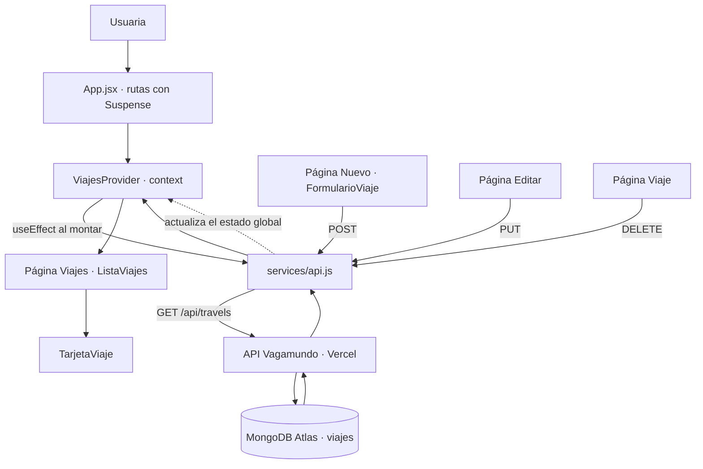

# Vagamundo · Web (PEC 4)

Frontend en **React + Vite** del proyecto Vagamundo. No tiene datos propios: todo el catálogo
de viajes se pide a la **API de la PEC 3** (Express + MongoDB Atlas) y se pinta en pantalla.

- **Frontend desplegado:** _(pendiente de desplegar en Vercel)_
- **Repositorio del frontend:** https://github.com/hellobymarta/vagamundo-web
- **Repositorio de la API (PEC 3):** https://github.com/hellobymarta/vagamundo-api
- **API desplegada:** https://vagamundo-api.vercel.app

## Flujo de la aplicación



## Estructura

```
PEC4/
├── .env.example          # variable de entorno necesaria (el .env real NO se sube)
├── jsconfig.json         # alias "@" para las importaciones absolutas
├── vite.config.js        # React, Tailwind y el alias "@" -> src
├── vercel.json           # reescrituras para que funcione el router en producción
└── src/
    ├── config/
    │   └── constantes.js       # API_URL, RUTA_VIAJES, CATEGORIAS… (UPPER_SNAKE_CASE)
    ├── services/
    │   └── api.js              # todas las llamadas a la API, en un solo sitio
    ├── context/
    │   └── viajes-context.jsx  # estado global del catálogo
    ├── hooks/
    │   ├── use-viajes.js       # atajo para leer el contexto
    │   └── use-formulario.js   # formularios controlados
    ├── components/             # boton, campo, aviso, cargando, cabecera, pie,
    │   │                       # tarjeta-viaje, lista-viajes, formulario-viaje
    ├── pages/                  # viajes, viaje, destinos, destino, nuevo,
    │   │                       # editar, no-encontrada
    ├── App.jsx
    └── main.jsx
```

## Instalación y ejecución

### Frontend (este proyecto)

```bash
npm install
cp .env.example .env      # y revisa la URL de la API
npm run dev               # http://localhost:5173
```

### Backend (PEC 3, si quieres levantarlo en local)

```bash
cd ../PEC3
npm install
cp .env.example .env      # rellena MONGODB_URI con tu cadena de Atlas
npm run dev               # http://localhost:4000
```

Si levantas la API en local, cambia en el `.env` del frontend:

```
VITE_API_URL=http://localhost:4000
```

## Variables de entorno

| Variable | Dónde | Descripción |
|----------|-------|-------------|
| `VITE_API_URL` | frontend | URL base de la API, sin barra final. |
| `MONGODB_URI` | backend | Cadena de conexión de MongoDB Atlas. |
| `PORT` | backend | Puerto local de la API (4000 por defecto). |

En Vite, solo las variables que empiezan por `VITE_` llegan al navegador, y se leen con
`import.meta.env.VITE_API_URL`. En este proyecto se lee **una sola vez**, en
`src/config/constantes.js`; ningún componente escribe la URL a mano.

## Endpoints usados

| Método | Ruta | Dónde se usa |
|--------|------|--------------|
| GET | `/api/travels` | Catálogo (página principal). |
| GET | `/api/travels/:id` | Disponible en `services/api.js`. |
| POST | `/api/travels` | Formulario de «Añadir viaje». |
| PUT | `/api/travels/:id` | Página de edición. |
| DELETE | `/api/travels/:id` | Ficha del viaje. |

## Diseño

La maquetación toma como base **nuba.com** y le añade dos piezas concretas de
**utopica.travel**. Antes de maquetar medí lo que hacen por dentro (tipografías, colores y
rejilla), y de ahí salen estas decisiones.

### De NUBA, el esqueleto

- **La cabecera y su efecto de scroll.** Lo medí en su propia web, abriendo sus hojas de estilo:
  usan una clase `.did-scroll` en el `body` y el cambio es exactamente este —

  | | arriba de la página | al bajar |
  |---|---|---|
  | alto | 90 px | 75 px |
  | fondo | transparente | `rgb(239, 235, 230)` |
  | texto y logotipo | blancos | negros |
  | borde inferior | ninguno | 1 px |

  con `transition: height 0.6s`. Aquí lo resuelve el hook `use-cabecera-solida`, y como en su web
  la barra también se vuelve sólida al pasar el ratón por encima. El logotipo va centrado en
  absoluto (`left: 50%`), no con el flex, para que no se mueva aunque cambien los menús.
- **La portada rotativa.** Ocupa la ventana entera (`h-dvh`, que es la altura real también en el
  móvil) y va pasando sola cada siete segundos, con el epígrafe en serif (no en mayúsculas), el
  titular grande, un botón **rectangular** de contorno fino y la paginación en puntitos. El paso
  automático está en `useCarrusel`, con su `clearInterval` al desmontar; al pulsar un punto el
  reloj se reinicia.
- **Los destinos.** Como ellos, cada sitio tiene entidad propia: un índice en `/destinos`
  agrupado por continente, con una ficha por destino y el número de viajes que hay abiertos, y
  una página propia en `/destinos/:pais` con su portada, el contorno del país, una entradilla,
  los viajes que tenemos allí, los tres pasos, las dudas y la llamada a la acción. Los destinos
  que estamos preparando aparecen igual, pero dicen «Próximamente» en vez de mentir.
  Todo está en `config/destinos.js`: el modelo de la API solo guarda un `destino` de texto libre
  («Nordeste de Brasil»), así que ahí vive la tabla que lo traduce a un destino de verdad, con su
  continente, su fotografía y su texto — el mismo truco que las siluetas de los mapas.
- **El orden de la home.** Portada → bloque de marca centrado con «leer más» → destinos
  destacados en tres columnas → experiencias → catálogo → boletín → pie a cuatro columnas.
- **El listado de destinos por continente**, en cuatro columnas con el continente en serif
  espaciado. Aquí los que están en el catálogo se vuelven enlaces y el resto quedan apagados.
- **La escala tipográfica.** Ninguna de las referencias pasa de 40 px en los títulos de sección:
  el aire hace el trabajo, no el tamaño. Por eso la escala va con `clamp()`.

### De Utópica, dos piezas

- **El explorador de viajes** (`explorador.jsx`): la foto a sangre muy apagada, el contorno del
  país dibujándose arriba, el nombre del viaje en **cursiva serif** en el centro, los vecinos
  apagados a los lados y dos flechas abajo. Los contornos no están dibujados a mano: los genero
  con el atlas de *world-atlas* (Natural Earth 1:110m) proyectado en Mercator y limpio de islas
  pequeñas — 55 países en `config/siluetas.js`.
- **La marquesina** (`marquesina.jsx`): tres filas de nombres enormes en serif deslizándose
  sobre fondo oscuro, cada una a su ritmo y en su sentido. Es CSS puro: la lista va duplicada
  dentro de la fila y la fila se desplaza exactamente el 50 % de su ancho, así el bucle no se ve.
- También su **cursiva metida dentro del titular** («Comparte tus *sueños* con nosotras»), su
  **formulario sobre fondo caqui** con los campos sin caja, y la **banda oscura de cierre**
  con la pregunta a la izquierda y la llamada a la acción a la derecha.

### De Travel Machine, el cursor

`cursor.jsx` dibuja un punto blanco de 12 px que sigue al ratón y, al pasar por encima de algo
pulsable, crece a 44 px y se queda hueco. El cursor del sistema se esconde con `cursor: none` en
`index.css`, y en pantallas táctiles (`@media (hover: none)`) no se dibuja nada y vuelve el de
siempre. Lleva `mix-blend-difference`, así que se lee tanto sobre las fotos oscuras como sobre el
fondo crema sin cambiarle el color.

### De Wilderness

Los tres pasos numerados 01/02/03, el precio en formato «Desde X € por persona», la duración en
«días · noches», los dos testimonios con firma y lugar, y las preguntas frecuentes (aquí con
`<details>`, sin JavaScript).

### Tipografías y color

*Playfair Display* en peso 400 para los títulos, también en cursiva, que es como Utópica titula
sus destinos; *Montserrat* a 11 px en mayúsculas con mucho interletrado para las etiquetas; e
*Inter* en peso 300 para el texto corrido.

De su código no hay ni una línea, y los colores tampoco son suyos: la paleta es la de la
práctica del día 24, sacada de mis propias fotografías de la costa amalfitana — azul del mar
para el pie, y un pastel por sección (rosa buganvilla, terracota, amarillo limón y verde oliva).

### Fotografías

Las de Positano, Amalfi y Atrani son mías, de la PEC 1. Las de Apulia, Grecia, Jordania, Brasil,
Namibia, India, Uzbekistán, Guatemala, Costa Rica y el salar están extraídas de los catálogos de
viajes de 2026 y se usan solo con fines académicos en esta práctica.

Cada foto va con su sitio: `fotoDeDestino()` resuelve la fotografía que corresponde a un destino,
así que un viaje a Namibia nunca sale ilustrado con una foto de Amalfi, ni cuando el viaje no
trae imagen propia, ni en el bloque del itinerario, ni en el explorador.

## Decisiones de arquitectura

- **Importaciones absolutas.** El alias `@` apunta a `src`, así que se importa
  `@/components/boton` en vez de contar carpetas hacia atrás. Configurado en `vite.config.js`
  (para que funcione al compilar) y en `jsconfig.json` (para que VS Code lo autocomplete).
- **Suspense.** Cada página se carga con `React.lazy` y las rutas van envueltas en
  `<Suspense>`, de modo que el navegador solo descarga el código de la pantalla que se abre.
- **Contexto global.** El catálogo se pide una vez en `ViajesProvider` y lo comparten todas las
  páginas; la ficha y la edición no repiten la llamada, buscan el viaje en el estado que ya existe.
- **Un `useState` por componente.** El estado del catálogo (`viajes`, `cargando`, `guardando`,
  `error`, `aviso`) está agrupado en un único objeto porque son datos relacionados, y el de los
  formularios vive entero en el hook `useFormulario`.
- **Listas sin índice.** Todos los `map` usan el `_id` de MongoDB como `key`, nunca la posición.
- **Deconstrucción y spread.** En el listado se deconstruye cada viaje
  (`{ _id, ...viaje }`) y el resto de sus datos se pasan a `<TarjetaViaje>` con el operador spread.

## El catálogo

`semillas.http` trae los **nueve viajes**, repartidos en cuatro zonas:

| Zona | Viajes |
|------|--------|
| Mediterráneo | Amalfi en primavera · Apulia inédita · Del continente a Santorini |
| África austral y Oriente Medio | Namibia, de Etosha al Kalahari · Jordania, el desierto por dentro |
| América Latina | Ruta de las emociones · Guatemala, del lago a la selva |
| Asia | India, de Delhi al Ganges · La Ruta de la Seda |

La duración, el precio y la ruta de cada uno salen de los catálogos de viajes de 2026; los
nombres y los textos están escritos con la voz de Vagamundo. Se lanzan con la extensión
**REST Client** de VS Code, pulsando «Send Request» encima de cada bloque.

Las categorías son `Costa`, `Islas`, `Cultural`, `Ciudad`, `Naturaleza` y `Desierto`: seis, una
por cada baldosa de «Imagina tu viaje», y ninguna se queda a cero.

## Despliegue en Vercel

1. Sube el proyecto a GitHub.
2. Importa el repositorio en Vercel (framework: **Vite**).
3. En **Settings → Environment Variables**, añade `VITE_API_URL` con la URL de la API.
4. Despliega y comprueba que el catálogo se llena con los datos de Atlas.
