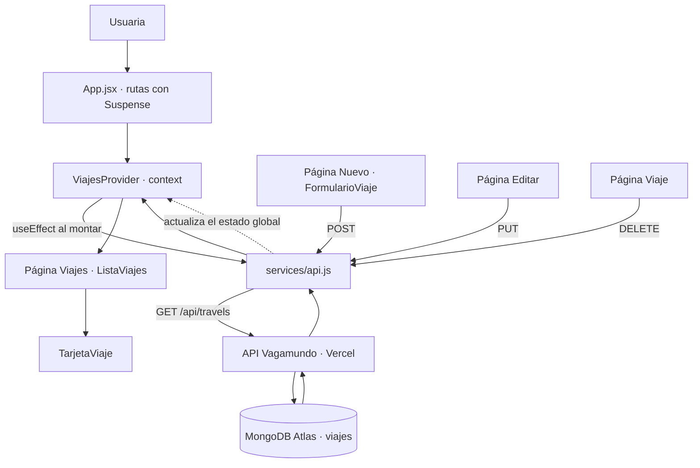

# Vagamundo · Web (PEC 4)

Frontend en **React + Vite** del proyecto Vagamundo. No tiene datos propios: todo el catálogo
de viajes se pide a la **API de la PEC 3** (Express + MongoDB Atlas) y se pinta en pantalla.

- **Frontend desplegado:** _(pendiente de desplegar en Vercel)_
- **Repositorio del frontend:** https://github.com/hellobymarta/vagamundo-web
- **Repositorio de la API (PEC 3):** https://github.com/hellobymarta/vagamundo-api
- **API desplegada:** https://vagamundo-api.vercel.app

## Flujo de la aplicación



## Estructura

```
PEC4/
├── .env.example          # variable de entorno necesaria (el .env real NO se sube)
├── jsconfig.json         # alias "@" para las importaciones absolutas
├── vite.config.js        # React, Tailwind y el alias "@" -> src
├── vercel.json           # reescrituras para que funcione el router en producción
└── src/
    ├── config/
    │   └── constantes.js       # API_URL, RUTA_VIAJES, CATEGORIAS… (UPPER_SNAKE_CASE)
    ├── services/
    │   └── api.js              # todas las llamadas a la API, en un solo sitio
    ├── context/
    │   └── viajes-context.jsx  # estado global del catálogo
    ├── hooks/
    │   ├── use-viajes.js       # atajo para leer el contexto
    │   └── use-formulario.js   # formularios controlados
    ├── components/             # boton, campo, aviso, cargando, cabecera, pie,
    │   │                       # tarjeta-viaje, lista-viajes, formulario-viaje
    ├── pages/                  # viajes, viaje, nuevo, editar, no-encontrada
    ├── App.jsx
    └── main.jsx
```

## Instalación y ejecución

### Frontend (este proyecto)

```bash
npm install
cp .env.example .env      # y revisa la URL de la API
npm run dev               # http://localhost:5173
```

### Backend (PEC 3, si quieres levantarlo en local)

```bash
cd ../PEC3
npm install
cp .env.example .env      # rellena MONGODB_URI con tu cadena de Atlas
npm run dev               # http://localhost:4000
```

Si levantas la API en local, cambia en el `.env` del frontend:

```
VITE_API_URL=http://localhost:4000
```

## Variables de entorno

| Variable | Dónde | Descripción |
|----------|-------|-------------|
| `VITE_API_URL` | frontend | URL base de la API, sin barra final. |
| `MONGODB_URI` | backend | Cadena de conexión de MongoDB Atlas. |
| `PORT` | backend | Puerto local de la API (4000 por defecto). |

En Vite, solo las variables que empiezan por `VITE_` llegan al navegador, y se leen con
`import.meta.env.VITE_API_URL`. En este proyecto se lee **una sola vez**, en
`src/config/constantes.js`; ningún componente escribe la URL a mano.

## Endpoints usados

| Método | Ruta | Dónde se usa |
|--------|------|--------------|
| GET | `/api/travels` | Catálogo (página principal). |
| GET | `/api/travels/:id` | Disponible en `services/api.js`. |
| POST | `/api/travels` | Formulario de «Añadir viaje». |
| PUT | `/api/travels/:id` | Página de edición. |
| DELETE | `/api/travels/:id` | Ficha del viaje. |

## Diseño

La maquetación continúa la línea de la PEC 1 y de la práctica del día 24, y toma como
referencia tres webs de viajes: **nuba.com**, **utopica.travel** y
**safaris.wildernessdestinations.com**. De ellas vienen tres decisiones concretas:

- **Portadas a sangre.** Cada página abre con una fotografía a pantalla completa, la cabecera
  encima en transparente y el título en serif sobre la imagen, como hacen NUBA y Utópica.
- **Pareja tipográfica.** *Playfair Display* en peso 400 para los títulos, con el interletrado
  ligeramente cerrado, y *Montserrat* en 11 px y mayúsculas muy espaciadas para las etiquetas
  de sección. Es exactamente el criterio de Utópica; el texto corrido va en *Inter* en peso 300.
- **Fichas editoriales.** Foto vertical 4:5, etiqueta de categoría, título serif, filete fino y
  precio alineado abajo, al modo de las tarjetas de Wilderness.

Los colores no se han copiado de ninguna de las tres: son los de la práctica del día 24, sacados
de mis propias fotografías de la costa amalfitana. El azul se reserva para la cabecera, las
portadas y el pie, y cada sección de la portada lleva su propio pastel (rosa, terracota, amarillo
y oliva). Las fotografías de `public/` también son propias.

## Decisiones de arquitectura

- **Importaciones absolutas.** El alias `@` apunta a `src`, así que se importa
  `@/components/boton` en vez de contar carpetas hacia atrás. Configurado en `vite.config.js`
  (para que funcione al compilar) y en `jsconfig.json` (para que VS Code lo autocomplete).
- **Suspense.** Cada página se carga con `React.lazy` y las rutas van envueltas en
  `<Suspense>`, de modo que el navegador solo descarga el código de la pantalla que se abre.
- **Contexto global.** El catálogo se pide una vez en `ViajesProvider` y lo comparten todas las
  páginas; la ficha y la edición no repiten la llamada, buscan el viaje en el estado que ya existe.
- **Un `useState` por componente.** El estado del catálogo (`viajes`, `cargando`, `guardando`,
  `error`, `aviso`) está agrupado en un único objeto porque son datos relacionados, y el de los
  formularios vive entero en el hook `useFormulario`.
- **Listas sin índice.** Todos los `map` usan el `_id` de MongoDB como `key`, nunca la posición.
- **Deconstrucción y spread.** En el listado se deconstruye cada viaje
  (`{ _id, ...viaje }`) y el resto de sus datos se pasan a `<TarjetaViaje>` con el operador spread.

## Despliegue en Vercel

1. Sube el proyecto a GitHub.
2. Importa el repositorio en Vercel (framework: **Vite**).
3. En **Settings → Environment Variables**, añade `VITE_API_URL` con la URL de la API.
4. Despliega y comprueba que el catálogo se llena con los datos de Atlas.
